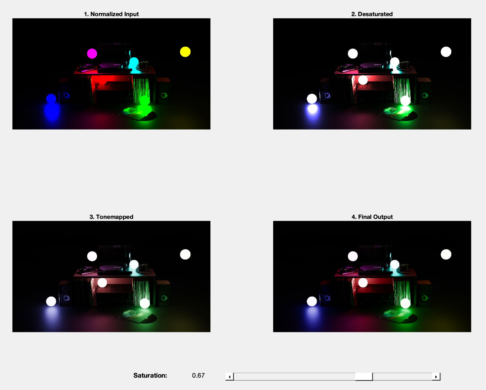

# RL_tonemapper

## About

Custom MATLAB tonemapper for a university project.  
The tonemapper is based on Troy Sobotka's Agx. 
Includes a simple GUI with a saturation slider that controls the strength of desaturation and resaturation and a slider for the white point for the reinhard tonemapping.  
Visualizes the 4 main steps of the pipeline in a 2x2 layout:  
1. Normalize  
2. Desaturate  
3. Tonemapping (Reinhard)  
4. Resaturate  

Meant for exploring basic color manipulation techniques in an HDR workflow.

---

## Credits
- Based on Agx Tonemapping by Troy Sobotka:
  [Agx Tonemapping](https://github.com/sobotka/AgX) 

- The `remap` function is adapted from:
  **Vlad Atanasiu (2025).** *Remap numerical values*. [MATLAB Central File Exchange](https://www.mathworks.com/matlabcentral/fileexchange/54404-remap-numerical-values). Accessed June 23, 2025.

- The `tonemapping` is adapted from:
  **Reinhard, Erik, et al.** (2002). [Photographic tone reproduction for digital images](https://www-old.cs.utah.edu/docs/techreports/2002/pdf/UUCS-02-001.pdf) (Tech. Rep. UUCS-02-001). School of Computing, University of Utah.
